# Arquitetura do disparo em massa (proposta)

> Fonte única de lógica no SDK, Apps Script fino, config normalizada via cache de rodada.
> **Sem servidor. Sem Node em produção.** Só Apps Script + isolates do fluxo + classes.

## Princípios

- **Uma fonte da verdade:** a lógica de disparo mora numa classe do SDK (`W_Dispatch`), consumida pelo code node. Nada de lógica de negócio duplicada no Apps Script (evita drift).
- **Motor agnóstico:** `W_Dispatch` executa um `DispatchSpec` (campos, e-mails derivados, custom fields, políticas = **parâmetros**). Nada de avel/XP/`contas.xp` hardcoded — cada campanha é um spec diferente, o motor é o mesmo.
- **Config normalizada:** a config constante da rodada (assessores, nº de variáveis, id do campo XP, opções) NÃO viaja carimbada em cada linha do arquivo. Ela é escrita **uma vez** num cache e lida pelos isolates.
- **Sem slug/fallback:** assessor resolvido por mapa `userId → advisorId` (não por parsing de `+userId@`); status como enum; sem cascatas `a || b || c` nem `catch {}` mudo.
- **Cache = foto da rodada:** escrito antes do disparo, lido durante, **apagado no fim**.

## Runtimes (o que existe de verdade)

| Runtime | Papel | Escreve estado durável? |
|---|---|---|
| **Apps Script** | o operador aciona; resolve config 1x; grava o cache; dispara | Sim — já escreve `W_Variables` (refresher). Escreve `W_HabllaCache` do mesmo jeito. |
| **Isolate do fluxo** (1 por contato) | roda `W_Dispatch.run($input)`; **só lê** o cache | Não — stateless, só ponte HTTP. |
| **Classes** (`W_HabllaClient`, `W_Variables`, `W_HabllaCache`, `W_Dispatch`, `W_Utils`) | SDK compilado + estado global lido pelos isolates | — |

## Fluxo completo

```mermaid
sequenceDiagram
    autonumber
    actor Op as Operador
    participant AS as Apps Script
    participant API as Hablla API
    participant WC as W_HabllaCache (classe)
    participant CP as Campanha
    participant IS as Isolate (1/contato)
    participant WD as W_Dispatch (SDK)

    Op->>AS: clica "disparar" (audiência + escolhas)
    Note over AS: gera runId; resolve config 1x;<br/>expiresAt = agora + ceil(contatos/batch)×intervalo + SLA + 5min
    AS->>WC: PUT cache[runId] = {config, expiresAt} + publish
    AS->>API: cria campanha (xlsx SÓ-CONTATOS, cada linha carrega runId)
    API->>CP: enfileira e dispara por lote (com intervalo)

    loop cada contato (espalhado no tempo)
        CP->>IS: executa code node com $input = {contato, runId}
        IS->>WD: W_Dispatch.run($input)
        WD->>WC: lê cache[runId] (global, sem fetch)
        WD->>API: acha/cria pessoa, resolve assessor, envia template
        WD-->>CP: status (enum) do contato
    end

    Note over WC: cache[runId] expira sozinho no expiresAt (fim do disparo + margem)
```

### Escrita e leitura do cache (por que não tem corrida)

- **Escrita:** só o **Apps Script**, **uma vez**, antes do disparo (o operador clica uma vez → uma execução → sem concorrência). Igual ao refresher que já grava o token no `W_Variables`.
- **Leitura:** cada isolate novo carrega o conteúdo publicado da classe e lê `cache[runId]` como global — exatamente como já lê o token pelo `HABLLA_ENV`. Zero escrita de dentro do isolate → zero tempestade de publish.

## Ciclo de vida do cache

> **Achado de teste (importante):** o status `done` da campanha **NÃO serve** como gatilho de limpeza.
> Num teste (3 registros, 1 min entre cada), todas as execuções terminaram mas a campanha ficou
> `running` por 6+ min, e o `processed_status` travou em `done:1`. As campanhas *eventualmente*
> viram `done`, mas com lag enorme (job de reconciliação). Além disso, com intervalo entre envios,
> os isolates leem o cache **ao longo de toda a rodada** (pode durar horas) — o cache tem que durar isso.

Por isso a limpeza é **por expiry calculado**, não por `done`. Foto por-rodada (`runId`) com `expiresAt` dimensionado pela própria matemática do disparo:

```
batches   = ceil(contatos / batch_size)
duração   = batches × batch_interval          (minutos — o Apps Script já tem esses números)
expiresAt = agora + duração + SLA + 5 (tolerância)
```



```mermaid
stateDiagram-v2
    [*] --> Escrito: Apps Script grava cache[runId] com expiresAt calculado + publish
    Escrito --> Lido: isolates leem durante a rodada (execuções espalhadas no tempo)
    Lido --> Expirado: passou o expiresAt (fim do disparo + margem)
    Expirado --> [*]: entrada vencida ignorada na leitura; purgada na próxima escrita
```

- **Chave = `runId`** (gerado no disparo, vai em cada linha) → foto isolada por rodada; campanhas concorrentes convivem.
- **`expiresAt` calculado** pela matemática do lote (contatos/`batch_size`×`batch_interval`) + SLA + **5 min de tolerância** → o cache vive **exatamente** o tempo do disparo + margem. Sem chute de 24h, sem depender do `done`.
- **Auto-limpeza:** a entrada expira sozinha no fim; leitura ignora entrada vencida; a próxima escrita purga as vencidas (mantém o blob pequeno).

## Formas de dados

**Linha do arquivo (xlsx) — só contato + a chave da rodada:**
```
phone | primeiroNome | name | userId | email | Contas XP | Customer IDs | IDs do Zenvia | runId
```
> Some o `advisors_json` gordo e as colunas de config repetidas. A linha carrega só o contato + `runId`.

**Cache (`W_HabllaCache`) — foto da rodada = um `DispatchSpec` agnóstico + expiry:**
```jsonc
{
  "run_abc123": {
    "connection": "6a1f…", "template": "6a4d…", "sector": "6a14…", "varNeed": 1,

    "onOpen": "skip",            // skip | finishAndSend
    "onMissing": "create",       // skip | create
    "ownerFallback": "advId…",

    "advisorField": "userId",                  // qual campo do registro é o código do assessor
    "advisors": { "1177": "advId…", "…": "…" },// mapa resolvido userId → advisorId

    "person": {                  // COMO montar a pessoa — tudo parâmetro (nada de avel/XP no motor)
      "nameField": "name",
      "phoneField": "phone",
      "emailFields": ["email"],                // campos que já são e-mail
      "derivedEmails": [                         // regras de e-mail sintético (contas.xp é UMA delas)
        { "sourceCustomFieldId": "6a0c721a0c96ad8935ad4086", "separator": "+", "domain": "contas.xp" }
      ],
      "customFields": "auto"                     // copia todo cf_<id> do $input; ou lista explícita de ids
    },

    "expiresAt": 1720086400000
  }
}
```
> **Campos personalizados são referenciados por ID** (a entidade `CustomField`, ex.: `6a0c72…`), não por nome — no `$input` eles chegam como `cf_<id>`, então o spec fala a mesma língua. `advisors` é um **mapa `userId → advisorId`**. `derivedEmails: []` numa campanha sem XP → mesmo motor. `expiresAt` = fim calculado do disparo + SLA + 5 min.

### O spec é a saída de um form de mapeamento

O operador **não escreve JSON**. O tool tem o form de mapeamento (já existe: os selects de coluna). Ele:
1. lista os campos personalizados do workspace (`listPersonFields` → `{id, name}`);
2. deixa o operador escolher qual coluna/campo é o quê (telefone, nome, e-mails, custom fields) e, se precisar, adicionar regras de e-mail derivado (fonte = um campo personalizado **pelo id**, separador, domínio);
3. **serializa isso no `DispatchSpec`** (com os ids corretos) e grava no `cache[runId]`.

Ou seja: **form → spec → cache → motor**. O motor nunca vê "Contas XP" nem "contas.xp" hardcoded — só o spec que o form montou.

### Padrão de referência de campo (normal × personalizado)

**Toda referência no spec é uma chave do `$input`** — o motor lê sempre `$input[ref]`, sem distinguir tipo:

| Tipo de campo | Como referencia no spec | Exemplo |
|---|---|---|
| **Normal** (coluna comum) | o nome da coluna | `"phone"`, `"email"`, `"name"` |
| **Personalizado** (`CustomField`) | `"cf_<id>"` | `"cf_6a0c721a0c96ad8935ad4086"` |

O que muda **não é a leitura**, é o **slot** — onde o valor vai parar na pessoa. O motor monta a pessoa de forma determinística a partir do spec:

```js
// pseudocódigo do preenchimento (W_Dispatch), uniforme p/ normal e custom
person.name  = $input[spec.nameField];              // ex.: $input["name"]
person.phone = $input[spec.phoneField];             // ex.: $input["phone"]

person.emails = [
    ...spec.emailFields.map(k => $input[k]),         // e-mails diretos (normal ou cf_)
    ...spec.derivedEmails.map(rule => {              // e-mails sintéticos (contas.xp é UMA regra)
        const parts = String($input[rule.source] || "").split(/[^\dA-Za-z]+/).filter(Boolean);
        return parts.length ? parts.join(rule.separator) + "@" + rule.domain : null;
    }),
].filter(v => v && /@/.test(v)).map(email => ({ email }));

const cfKeys = spec.customFields === "auto"
    ? Object.keys($input).filter(k => /^cf_[a-f0-9]{24}$/.test(k))   // todos os personalizados do registro
    : spec.customFields;                                             // ou lista explícita de "cf_<id>"
person.custom_fields = cfKeys
    .filter(k => String($input[k]).trim())
    .map(k => ({ custom_field: k.slice(3), value: String($input[k]).trim() }));  // slice(3) = tira "cf_"
```

- `rule.source` pode ser **normal ou `cf_<id>`** — a regra de e-mail derivado é agnóstica à origem.
- Custom field vira `{ custom_field: <id>, value }` (o id sai do próprio `cf_<id>`).
- Se um dia a fonte das contas for uma coluna normal (não um campo personalizado), é só `rule.source: "accounts"` — **mesmo motor, mesmo padrão**.

## Responsabilidades das classes

| Classe | Responsabilidade |
|---|---|
| **`W_HabllaClient`** | HTTP + auth (workspace-first, retry, refresh resiliente). Já existe. |
| **`W_Variables`** | globais injetados (token via `HABLLA_ENV`). Já existe. |
| **`W_HabllaCache`** *(nova)* | KV durável lido pelos isolates: `cache[runId] = {config}`. Escrito pelo Apps Script. |
| **`W_Utils`** *(nova)* | funções puras reutilizáveis: `normalizePhone`, `phoneVariants`, `parseXpAccounts`, `buildContasXpEmail`, enum `Status`. |
| **`W_Dispatch`** *(nova)* | **executor genérico de um `DispatchSpec`** (o "como fazer" da rodada, lido do cache): acha/cria pessoa conforme o spec (campos, e-mails diretos + derivados, custom fields) → resolve assessor pelo mapa → trata atendimento (política) → envia template → retorna status (enum). **Zero conhecimento de avel/XP** — o domínio vive no spec, não no motor. |

## Code node (antes × depois)

**Antes:** ~170 linhas fazendo 8 coisas, com fallbacks, parsing de slug, e config lida de cada linha.

**Depois** (lê o spec da rodada no cache e executa — genérico):
```js
const spec = W_HabllaCache.get($input.runId);
return await W_Dispatch.run($input, spec);
```

## O que muda / o que fica

| | Hoje | Novo |
|---|---|---|
| Arquivo | xlsx com config repetida por linha (`advisors_json` inteiro) | xlsx só-contatos + `runId` |
| Config da rodada (mapa de assessores, var_need, xp_field, opções) | recalculada e carimbada em cada linha | em `cache[runId]` no `W_HabllaCache`, com `expiresAt` calculado, lida pelos isolates |
| Lógica de negócio | espalhada (Apps Script + code node) | 1 lugar: `W_Dispatch` (+ `W_Utils`) |
| Assessor | cascata + parsing de `+userId@` (slug) | mapa `userId → advisorId`, resolução explícita |
| Code node | monolito ~170 linhas | 1 linha |
| Formato | xlsx (o mais leve dos aceitos: ~193KB vs JSON 620KB) | xlsx (mantém) |
| Servidor / Node | nenhum | nenhum |

## Pontos em aberto (decidir antes de implementar)

1. **Valor do SLA na fórmula do `expiresAt`:** confirmar qual janela somar (flow_ttl? sessão?) além da duração calculada + 5 min de tolerância. A tolerância de 5 min cobre lag de fila/processamento.
2. **Drift residual:** o Apps Script continua **resolvendo** os derivados (como hoje faz o `advisors_json`). Não é lógica de negócio (que fica no SDK), mas é uma superfície de resolução no Apps Script. Aceitável? Ou minimizar mais?
3. **Latência do publish:** garantir a ordem `grava cache + publish` → `dispara campanha` (o Apps Script controla; publish antes do trigger).
4. **`W_HabllaCache` novo × estender `HABLLA_ENV`/`W_Variables`:** classe dedicada pro cache × reaproveitar o global que já existe. Uma classe dedicada isola melhor a responsabilidade.

> **Descartado:** limpeza via status `done` da campanha — teste mostrou que `done` chega com lag enorme e o `processed_status` é não-confiável. TTL no lugar.
